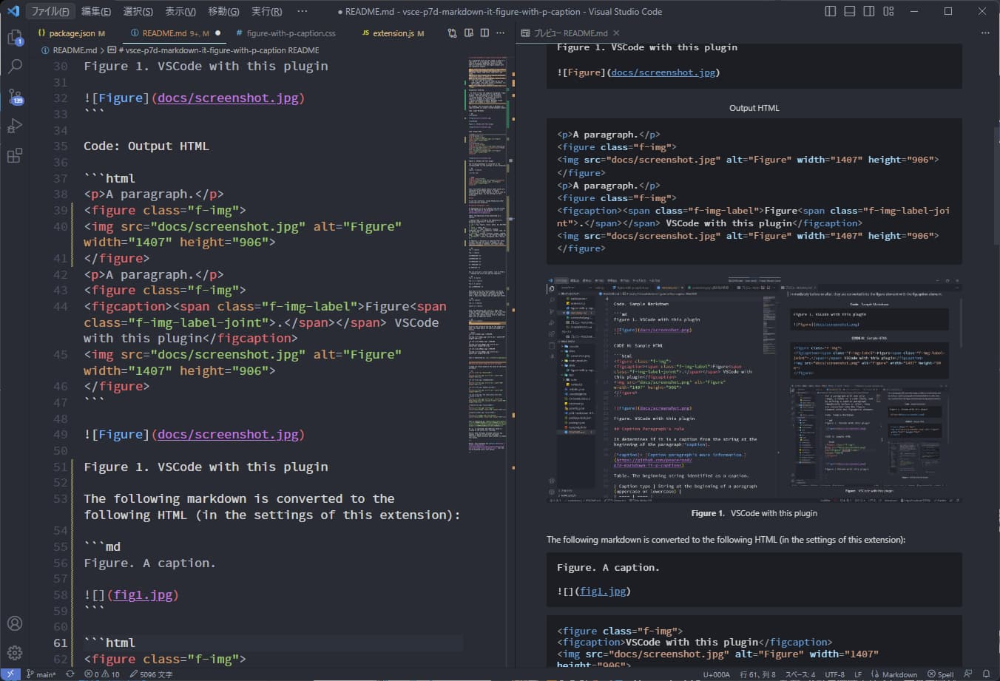
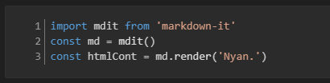

# vsce-p7d-markdown-it-figure-with-p-caption README

For a paragraph with a image/images only, or a table or a code block or a blockquote, video, iframe and by writing a caption paragraph immediately before or after, they are converted into the figure element with the figcaption element.

## Process (Roughly)

The process is as follows.

1. Add width and height attributes, and loading="lazy" in img elements.
    - You can skip attribute processing of img elements with option.
2. Check that the element: an image/images only paragraph, a table, a code block, a samp block ,and a video, a iframe.
3. Check if this element has a caption paragraph immediately before or after it.
    - Even if there is no caption, if it is image only paragraph (and video/iframe element depending on the option), proceed to the next step.
    - At this point, a class attribute is attached to the determined caption and its label.
         - if caption label do not has label number, the label itself is deleted. (Except in case of blockquote caption label. This is default setting.)  
         This default label deletion process also occurs at the beginning of a normal paragraph. But if it's a general document, this shouldn't be a problem.
4. If It has the caption paragraph, convert them to figure and figcaption element.
    - The class attribute etc. is attached to the figure element according to the caption label.
5. If It is samp block (that is codeblock surrounded by ```` ```smap```` ~ ```` ``` ````), convert `<code>` to `<samp>`. 
    - Although `samp` is specified, this conversion is applied even if `shell` or `console` is specified.

Notice. If markdown-it-attrs has not been imported by any other plugin, it will be imported. This allows you to specify attributes of the block by writing `{.style}` at the end of the line, etc.

## Use

If this extension does not work after installing it, please restart VSCode once.

## Caption Paragraph Rule

It determines if it is a caption from the string at the beginning of the paragraph ([more info](https://github.com/peaceroad/p7d-markdown-it-p-captions)).

Table. The beginning string identified as a caption.

| Caption type | String at the beginning of a paragraph (uppercase or lowercase) |
| ---- | ---- |
| `img` | fig, figure, illust, photo, 図, イラスト, 写真 |
| `table` | table, 表 |
| `pre-code` | code, codeblock, program, algorithm, コード, ソースコード, リスト, 命令, プログラム, 算譜, アルゴリズム, 算法 |
| `pre-samp` | console, terminal, prompt, command, 端末, ターミナル, コマンド, コマンドプロンプト, プロンプト |
| `blockquote` | source, quote, blockquote, 引用, 引用元, 出典 |
| `slide` | slide, スライド |

In addition, a delimiter is required after these strings, and then one space is needed. If the delimiter string is a full-width character, half-width spaces only are allowed.

```md
Fig. A caption

Fig: A caption

図．キャプション

図。キャプション

図：キャプション

図　キャプション

図 キャプション
```

You can also put a serial number, such as 0-9A-Z.-, between the first term and the separator.

```md
Fig 1. A caption

Fig 1.1. A caption

Fig A: A caption

図1.1：キャプション
```

Only when it has this serial number, it can be identified by omitting the separator and adding only a space. In English, the caption written after a space must begin with an uppercase letter.

```md
Fig 1 A caption.

Fig 1.1 A caption.

Figure A A caption
```

Also, It identifies the `Figure.1` type. This format has a dot immediately after the first term, a serial number and a space after it. In this case, too, the caption written after a space must begin with an uppercase letter.

```md
Figure.1 A caption.
```

## Example

For example, the following code is Markdown for input and HTML for output (vscode markdown viewer).

### Label only example

Currently, even if there is only a caption paragraph, it affects the preview and HTML output.

```md
Figure 1. A caption.

Figure. A caption.
```

```html
<p class="f-img"><span class="f-img-label">Figure 1<span class="f-img-label-joint">.</span></span> A caption.</p>
<p class="f-img">A caption.</p>
```

### Image example

Code. Input Markdown. image only paragraph, and caption paragraph.

```md
A paragraph.

Figure 1. A caption.


```

Code: Output HTML

```html
<p>A paragraph.</p>
<figure class="f-img">
<figcaption><span class="f-img-label">Figure 1<span class="f-img-label-joint">.</span></span> A caption.</figcaption>

</figure>
```



Figure 1. VSCode with this plugin

A caption paragraph can also be placed in the paragraph immediately following it.

```md


Figure A. A caption.
```

```html
<figure class="f-img">

<figcaption><span class="f-img-label">Figure A<span class="f-img-label-joint">.</span></span> A caption.</figcaption>
</figure>
```

In the case of images, the image-only paragraph without a caption is also converted to a figure element. (in this extension.)

```md
A paragraph.


A paragraph.
```

```html
<p>A paragraph.</p>
<figure class="f-img">
<figcaption>VSCode with this plugin</figcaption>

</figure>
<p>A paragraph.</p>
```

Notice. If you cannot specify whether the caption paragraph belongs to the top or bottom, try inserting `<!-- -->` only paragraph as appropriate.

```md


<!-- -->

Figure 1. By inserting `<!-- -->` at the top, you can indicate that this caption belongs to the image below.


```

The default setting for this extension is to hide the label itself if it does not have a sequential number. (Excluding blockquote labels described below.)

```md
Figure. A caption.


```

```html
<p>A paragraph.</p>
<figure class="f-img">
<figcaption>A caption.</figcaption>

</figure>
```

Inline image etc, all images set also attributes by this extensions.

```md
A paragraph   A paragraph.
```

```html
<p>A paragraph   A paragraph.</p>
```

Noitce. `p7dMarkdownItFigureWithPCaption.notSetImageElementAttributes`: Not set width, height, loading attributes of image element.

#### Multiple image example

For multiple images, the following class name is used instead of `f-img`.

- `f-img-horizontal`: if the image is written in one line
- `f-img-vertical`: if images are written only vertically, one per line
- `f-img-multiple` in other cases

Note that half-width spaces between images are removed.

```md
 
```

```html
<p>A paragraph. horizontal images only</p>
<figure class="f-img-horizontal">

</figure>
```

vertical images only:

```md


```

```html
<figure class="f-img-vertical">


</figure>
```

general multiple images:

```md
 

```

```html
<figure class="f-img-multiple">


</figure>
```

### Blockquote example

```md
> A quoted paragraph.

Source. A source.
```

```html
<figure class="f-blockquote">
<blockquote>
<p>A quoted paragraph.</p>
</blockquote>
<figcaption><span class="f-blockquote-label">Source<span class="f-blockquote-label-joint">.</span></span> A source.</figcaption>
</figure>
```

Of course, the source can be written just before blockquote.   
(The same goes for code blocks, tables, etc.)

Notice. If you do not want to display the blockquote label, delete `"blockquote"` in settings.json of setting option `p7dMarkdownItFigureWithPCaption.displayUnnumberedLabelMarks`.

### Code/Samp-block example

the figure element has class attribute and role="doc-example".
If `samp` or `shell`, `console` is specified, the samp tag will be used. If you use `shell` and `console`, span elements for code highlighting will be set.

~~~ {.language-md}
Code 1. A codeblock caption.

```js
console.log('Hello World!');
```

Terminal A. A terminal caption.

```samp
$ pwd
/home/user
```

Terminal B. A terminal caption.

```shell
$ pwd
/home/user
```
~~~

```html
<figure class="f-pre-code">
<figcaption><span class="f-pre-code-label">Code<span class="f-pre-code-label-joint">.</span></span> A codeblock caption.</figcaption>
<pre><code class="language-js">console.log('Hello World!');
</code></pre>
</figure>
<figure class="f-pre-samp">
<figcaption><span class="f-pre-samp-label">Terminal A<span class="f-pre-samp-label-joint">.</span></span> A terminal caption.</figcaption>
<pre><samp>$ pwd
/home/user
</samp></pre>
</figure>
<figure class="f-pre-samp">
<figcaption><span class="f-pre-samp-label">Terminal A<span class="f-pre-samp-label-joint">.</span></span> A terminal caption.</figcaption>
<pre><samp class="language-shell"><span class="hljs-meta prompt_">$ </span><span class="language-bash"><span class="hljs-built_in">pwd</span></span><span class="lineend-spacer"></span>
/home/user
</samp></pre>
</figure>
```

Of course, you can also do it without label numbers. (with default settings)

~~~ {.language-md}
Code. A codeblock caption.

```js
console.log('Hello World!');
```

Terminal. A terminal caption.

```samp
$ pwd
/home/user
```
~~~

```html
<figure class="f-pre-code">
<figcaption>A codeblock caption.</figcaption>
<pre><code class="language-js">console.log('Hello World!');
</code></pre>
</figure>
<figure class="f-pre-samp">
<figcaption>A terminal caption.</figcaption>
<pre><samp>$ pwd
/home/user
</samp></pre>
</figure>
```

**Notice.** In versions prior to 0.5, `role="doc-example"` was output to the figure element surrounding the code/samp block, but in 0.5, it is no longer output by default. If you want to output it, set the option `setRoleDocExample` to `true`.

### Table example

```md
Table 1. A Caption.

| Tokyo | Osaka |
| ----- | ----- |
| Sushi | Takoyaki |
```

```html
<figure class="f-table">
<figcaption><span class="f-table-label">Table<span class="f-table-label-joint">.</span></span> A Caption.</figcaption>
<table>
<thead>
<tr>
<th>Tokyo</th>
<th>Osaka</th>
</tr>
</thead>
<tbody>
<tr>
<td>Sushi</td>
<td>Takoyaki</td>
</tr>
</tbody>
</table>
</figure>
```

### Video example

The Video is wrapped in a figure element without a caption, just like processing a single image.

```md
Video 1. A mp4.

<video controls width="400" height="300" src="https://example.com/sample.mp4">
<a href="https://example.com/sample.mp4">Download Video: sample.mp4</a>
</video>
```

```html
<figure class="f-video">
<figcaption><span class="f-video-label">Video<span class="f-video-label-joint">.</span></span> A mp4.</figcaption>
<video controls width="400" height="300" src="https://example.com/sample.mp4">
<a href="https://example.com/sample.mp4">Download Video: sample.mp4</a>
</video>
</figure>
```

If you want to wrap a video element without a caption in figure element, enable the option: `p7dMarkdownItFigureWithPCaption.wrapVideoWithoutCaptionByFigure`

```md
<video controls width="400" height="300">
<source src="example.mp4" type="video/mp4">
</video>
```

```html
<figure class="f-video">
<video controls width="400" height="300">
<source src="example.mp4" type="video/mp4">
</video>
</figure>
```

Notice. In the vscode markdown preview, a div[data-line] element is automatically inserted just before the video element. (This element is not present in HTML output.)

### iframe/embed example

If there is a caption paragraph, a iframe element is wrapped by figure element. Basically, `f-iframe` is assigned to the class attribute of the figure element. However, note that class attribute's value of the caption depends on the original caption label. (for now).

```md
Figure 1. A caption.

<iframe>
...
</iframe>

Slide. A caption.

<iframe class="speakerdeck-iframe" style="..." src="https://speakerdeck.com/player/xxxxxxxxxxxxxx" title="xxxxxxxxxxx" allowfullscreen="true" data-ratio="1.78343949044586" frameborder="0"></iframe>
```

```html
<figure class="i-frame">
<figcaption><span class="f-img-label">Figure 1<span class="f-img-label-joint">.</span></span> A caption.</figcaption>
<iframe>
</iframe>
...
</figure>
<figure class="f-iframe">
<figcaption><span class="f-slide-label">Slide<span class="f-slide-label-joint">.</span></span> A caption.</figcaption>
<iframe class="speakerdeck-iframe" style="..." src="https://speakerdeck.com/player/xxxxxxxxxxxxxx" title="xxxxxxxxxxx" allowfullscreen="true" data-ratio="1.78343949044586" frameborder="0"></iframe>
</figure>
```

Notice. In the vscode markdown preview, a div[data-line] element is automatically inserted just before the iframe element. (This element is not present in HTML output.)

If you want to wrap a iframe element without a caption in figure element, enable the option: `p7dMarkdownItFigureWithPCaption.wrapIframeWithoutCaptionByFigure`

```md
<iframe src="https://example.com/embed" class="mastodon-embed" style="max-width: 100%; border: 0" width="400" allowfullscreen="allowfullscreen"></iframe><script src="https://exapmle.com/embed.js" async="async"></script>
```

```html
<figure class="f-iframe">
<iframe src="https://example.com/embed" class="mastodon-embed" style="max-width: 100%; border: 0" width="400" allowfullscreen="allowfullscreen"></iframe><script src="https://exapmle.com/embed.js" async="async"></script>
</figure>
```

#### Exceptional handling

In the case of Youtube and Vimeo, `f-video` is used instead of `f-iframe`. And the video label caption can be used.

```md
Video. A youtube.

<iframe width="560" height="315" src="https://www.youtube-nocookie.com/embed/XXXXXXXXXXX" title="YouTube video player" frameborder="0" allow="accelerometer; autoplay; clipboard-write; encrypted-media; gyroscope; picture-in-picture" allowfullscreen></iframe>
```

```html
<figure class="f-video">
<figcaption><span class="f-video-label">Video<span class="f-video-label-joint">.</span></span> A youtube.</figcaption>
<iframe width="560" height="315" src="https://www.youtube-nocookie.com/embed/XXXXXXXXXXX" title="YouTube video player" frameborder="0" allow="accelerometer; autoplay; clipboard-write; encrypted-media; gyroscope; picture-in-picture" allowfullscreen></iframe>
</figure>
```

Notice. In the case of Vimeo, the tag text for embed includes the p element in addition to the iframe element, but please delete it or replace it with a caption.

In the case of X/Twitter, If a caption belonging to img such as "Figure" is used, `f-img` is used instead of `f-iframe`.

```md
Figure. Twitter Post.

<blockquote class="twitter-tweet"><p lang="ja" dir="ltr">XXXXX <a href="https://t.co/XXXXX">https://t.co/XXXXX</a></p>&mdash; UserName (@account) <a href="https://twitter.com/account/status/XXXXX">August 4, 2022</a></blockquote> <script async src="https://platform.twitter.com/widgets.js" charset="utf-8"></script>
```

```html
<figure class="f-img">
<figcaption><span class="f-img-label">Figure<span class="f-img-label-joint">.</span></span> Twitter Post.</figcaption>
<blockquote class="twitter-tweet"><p lang="ja" dir="ltr">XXXXX <a href="https://t.co/XXXXX">https://t.co/XXXXX</a></p>&mdash; User (@twitter) <a href="https://twitter.com/UserID/status/XXXXX">August 4, 2022</a></blockquote> <script async src="https://platform.twitter.com/widgets.js" charset="utf-8"></script>
</figure>
```

## Modify image element attributes

Image attributes are adjusted as follows by default.  
If you do not want to modify img element attributes, enable option: `p7dMarkdownItFigureWithPCaption.notSetImageElementAttributes`.

### Adjusting image size by filename suffix

Based on the string at the end of the image file name, a image adjust the width and height as follows.

```md
//image original size: 400x300.


<p></p>


↓
<p></p>


↓
<p></p>
```

This is identified by `/[@._-]([0-9]+)(x|dpi|ppi)$/`.

### Resizing layout image by title attribute

A image resize based on the value of the title attribute.

```md
//image original size: 400x300.


↓
<p></p>


↓
<p></p>


↓
<p></p>


↓
<p></p>


↓
<p></p>


↓
<p></p>
```

This is identified by `imageTitleAttribute.match(/(?:(?:(?:大きさ|サイズ)の?変更|リサイズ|resize(?:d to)?)? *[:：]? *([0-9]+)([%％]|px)|([0-9]+)([%％]|px)に(?:(?:大きさ|サイズ)を?変更|リサイズ))/i)`

If `px` is specified, the numerical value is treated as the width after resizing.

## Dispaly Line number for code/samp block

You can add a `start` or `data-pre-start` attribute to a code/samp block to display line numbers for that block.

~~~{.language-md}
```js {start="1"}
import mdit from 'markdown-it'
const md = mdit()
const htmlCont = md.render('Nyan.')
```
~~~

```html
<pre><code class="language-js" data-pre-start="1" style="counter-set:pre-line-number 1;"><span class="pre-line"><span class="hljs-keyword">import</span> mdit <span class="hljs-keyword">from</span> <span class="hljs-string">'markdown-it'</span></span><span class="lineend-spacer"></span>
<span class="pre-line"><span class="hljs-keyword">const</span> md = <span class="hljs-title function_">mdit</span>()</span><span class="lineend-spacer"></span>
<span class="pre-line"><span class="hljs-keyword">const</span> htmlCont = md.<span class="hljs-title function_">render</span>(<span class="hljs-string">'Nyan.'</span>)</span><span class="lineend-spacer"></span>
</code></pre>
```



Figure 2. Code block with Line number in markdown preview.

## Option

- `p7dMarkdownItFigureWithPCaption.disableStyle`: Disable [defalt CSS:](https://github.com/peaceroad/vsce-p7d-markdown-it-figure-with-p-caption/blob/main/style/figure-with-p-caption.css) of this extension.
- `p7dMarkdownItFigureWithPCaption.displayUnnumberedLabelMarks`: Display marks caption's unnumbered label. In that case, specify img, table, video, pre-code, pre-samp inside the array. ("blockquote" is set by default)
- `p7dMarkdownItFigureWithPCaption.displayUnnumberedLabel`: Display all caption's unnumbered label. Overrides option: displayUnnumberedLabelMarks.
- `p7dMarkdownItFigureWithPCaption.setDoubleQuoteFileName`: Set Filename. Part `"Filename"` of `Caption. "Filename" A text.` convert to `<strong class="f-pre-code-filename">Filename</strong>`.
- `p7dMarkdownItFigureWithPCaption.setDoubleAsteriskFileName`: Set Filename. Part `**Filename**` of `Caption. **Filename** A text.` convert to `<strong class="f-pre-code-filename">Filename</strong>`.
- `p7dMarkdownItFigureWithPCaption.convertJointSpaceToHalfWidth`: Convert full-width space to half-width space in label joint.
- `p7dMarkdownItFigureWithPCaption.notSetImageElementAttributes`: Not set width, height, lazyload attributes of image element.
- `p7dMarkdownItFigureWithPCaption.wrapIframeWithoutCaptionByFigure`: Wrap iframe element without a caption by figure element.
- `p7dMarkdownItFigureWithPCaption.wrapVideoWithoutCaptionByFigure`: Wrap video element without a caption by figure element.
- `p7dMarkdownItFigureWithPCaption.iframeTypeBlockquoteWithoutCaptionByFigure`: Wrap iframe type blockquote element without a caption by figure element

Notice. When you change the option, the screen will automatically reload, but if you don't hear it, restart VS Code once.


### Option to use image alt/tiltle as caption instead of paragraph caption

- `p7dMarkdownItFigureWithPCaption.useImgAltCaption`: Use the alt attribute of the img element for the caption. Specify the text of the label. Example: "Figure" , "図"
- `p7dMarkdownItFigureWithPCaption.useImgTitleCaption`: Use the title attribute of the img element for the caption. Specify the text of the label. Example: "Figure" , "図"

This allows the following transformation, which is a trade-off with the default behavior of writing the caption in the paragraph before it:

### useImgAltCaption: "Figure"

```md


```

```html
<figure class="f-img">
<figcaption><span class="f-img-label">Figure 1<span class="f-img-label-joint">.</span></span> A caption.</figcaption>

</figure>
<figure class="f-img">
<figcaption>A caption.</figcaption>

</figure>
```

### useImgTitleCaption: "Figure"

```md


```

```html
<figure class="f-img">
<figcaption><span class="f-img-label">Figure 1<span class="f-img-label-joint">.</span></span> A caption.</figcaption>

</figure>
<figure class="f-img">
<figcaption>A caption.</figcaption>

</figure>
```

#### yaml frontmatter setting of imgAltCaption / imgTitleCaption (beta)

Notice. Beta feature. I made it so that the settings would be effective even if you wrote `imgAltCaption: "Figure"` or `imgTitleCaption: "Figure"` in yaml frontmatter of the Markdown file, but currently this setting is not read in real time and works. Therefore, if you write the setting in markdown file, you need to restart once.

```md
---
imgAltCaption: "Figure"
---


```

## Command

Often captions are written in the alt and title attributes of images. This plugin includes commands to turn those into caption paragraphs in this plugin format.

Also, to insert figure numbers, I included a command to assign consecutive numbers to the figure caption paragraphs from the top of the Markdown file.

**Notice.** For now, it's a rough conversion. If you run the command twice in a row, the conversion results will be messed up.

### Command: setImgAltAttrToPCaption

Set markdown img alt attribute to caption's paragraph.

```md


↓

図　キャプション


```

```md


↓

図 キャプション


```

```md


↓

Figure. A. caption.


```

```md
---
lang: "en"
---


↓

Figure. A. caption.


```


**Notice.** Or, if you set option `p7dMarkdownItFigureWithPCaption.useImgAttrToPCaptionLabelLang`  to `en`, `Figure` will be used as the label instead of `図`.

### Command: setImgTitleAttrToPCaption

Markdown: Set img title attribute to caption's paragraph.

```md


↓

図　キャプション


```

```md
---
lang: "en"
---


↓

Figure. キャプション


```

### Command: setFigureCaptionNumber

Markdown: Set figure caption number.


```md
図 キャプション


図 キャプション


↓

図1 キャプション


図2 キャプション


```

```md
Figure. キャプション


Figure. キャプション


↓

Figure 1. キャプション


Figure 2. キャプション


```


## Build this extension package

```samp
$ npm run build
$ vsce package
```
