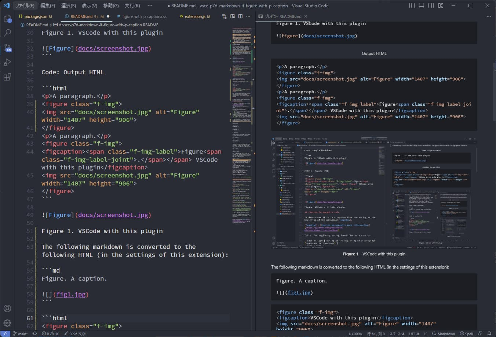

<!--
Test focus:
- imgAltCaption/imgTitleCaption enabled
- caption parsing edge cases (titles, attributes, blockquote, existing figure)
- rendererImage.resize default behavior
- displayUnnumberedLabelMarks default keeps blockquote labels
- table/code caption handling
-->

# Complete mditFigureWithPCaption Compatibility Test

## Test Case 1: Title has priority over alt



## Test Case 2: Alt text when no title


## Test Case 3: Title with multiple attribute specifications


## Test Case 4: Empty title should fall back to alt


## Test Case 5: Title with only attributes (no caption text)


## Test Case 6: Multiple images in sequence


## Test Case 7: Image in blockquote (should NOT be processed)

> 

## Test Case 8: Image already in figure (should NOT be processed)

<figure>

<figcaption>Existing caption</figcaption>
</figure>

## Test Case 9: No caption available (neither title nor alt)


## Test Case 10: Complex title parsing


## Test Case 11: Table caption handling

Table 1. Simple table caption.

| A | B |
| - | - |
| 1 | 2 |

## Test Case 12: Code block caption handling

Code 1. Example code block.

```js
console.log('hello')
```

## Test Case 13: Resize hints + blockquote label defaults


図1 ああ

> ああ

引用元 あああ


図1 ああ

